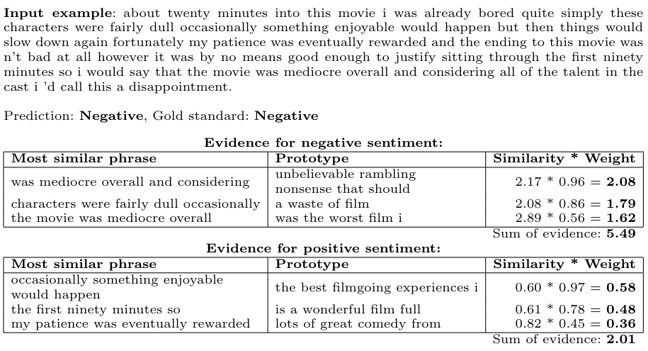

# ProtoCNN

This repository contains the source code used in the paper *"Prototypical Convolutional Neural Network for a phrase-based explanation of sentiment classification"*.
ProtoCNN is an explainable convolutional model for sentiment prediction in text, whose explanation can be represented as *'this looks like that'*.

## Example explanation



You can see more examples in the notebook: [experiments/example_explanations.ipynb](experiments/example_explanations.ipynb)

Sometimes Github does not display notebooks correctly. In this case, open it through Google Colab:
[https://colab.research.google.com/github/plutasnyy/ProtoCNN/blob/main/experiments/example_explanations.ipynb](https://colab.research.google.com/github/plutasnyy/ProtoCNN/blob/main/experiments/example_explanations.ipynb)

## Results
| **Dataset** | **ProSeNet** | **ProtoryNet** |  **ProtoCNN** (ours)| **CNN** (blackbox)|
| ------- | --- | --- | --- | --- |
| IMDB | 0.835 | 0.849 |  0.853 | 0.893 |
| Amazon Reviews | 0.840 | 0.882 |  0.880 | 0.911 |
| Yelp Reviews | 0.868 | 0.872 |  	0.834 | 0.867 |
| Rotten Tomatoes | 0.748 | 0.762 |  0.735 | 0.776 |
| Hotel Reviews | 0.909 | 0.949 |  0.904 | 0.929 |

#### Pretrained model weights and accuracy together with other metrics
[IMDB](https://www.comet.ml/plutasnyy/mgr-bench2/abc1851dba1c46f28e16ddd90ec9c3e6?experiment-tab=chart&showOutliers=true&smoothing=0&transformY=smoothing&viewId=XhJT2amMp2B13q9Vh8x0fHnu4&xAxis=epoch) | 
[Amazon Reviews](https://www.comet.ml/plutasnyy/mgr-bench2/e81f6bb0081f459c8e5c2b42cae6a2ea?experiment-tab=chart&showOutliers=true&smoothing=0&transformY=smoothing&viewId=XhJT2amMp2B13q9Vh8x0fHnu4&xAxis=epoch)  | 
[Yelp Reviews](https://www.comet.ml/plutasnyy/mgr-bench2/26daecaeebd246a9ac9c14bdbafcc1fe?experiment-tab=chart&showOutliers=true&smoothing=0&transformY=smoothing&viewId=XhJT2amMp2B13q9Vh8x0fHnu4&xAxis=epoch)  | 
[Rotten Tomatoes](https://www.comet.ml/plutasnyy/mgr-bench2/6b4aef88e5144aa396f4eef98490e3a7?experiment-tab=chart&showOutliers=true&smoothing=0&transformY=smoothing&viewId=XhJT2amMp2B13q9Vh8x0fHnu4&xAxis=epoch)  | 
[Hotel Reviews](https://www.comet.ml/plutasnyy/mgr-bench2/9378a9ae08c64f96a2e6fabcdc33fa3c?experiment-tab=chart&showOutliers=true&smoothing=0&transformY=smoothing&viewId=XhJT2amMp2B13q9Vh8x0fHnu4&xAxis=epoch) 

## Reproduction steps
The source code loads already tokenized examples (SpaCy tokenizer) from the 'data' directory, 
then creates instances of the dataset using torchtext (focus on installing the correct version, 
the API has been heavily changed in the latest version), the model is trained using Pytorch Lightning, 
and all results are logged into CometML.

#### CometML

Let's start by signing into CometML ( https://www.comet.ml/ )- it's a free tool that you can easily sign into using your GitHub account, 
then create a new project. In the project view, you will see sample code to create an experiment:

```python3
# import comet_ml at the top of your file
from comet_ml import Experiment

# Create an experiment with your api key
experiment = Experiment(
    api_key="privekey_of_your_account",
    project_name="yourprojectname",
    workspace="github_username",
)
```
You can pass these parameters to our training script, whereas this data is used in other places, 
so it will be most convenient to create a configuration file. Create `config.ini` file in main directory of project,
and pass your data into it. Example `config.ini`:

```ini
[cometml]
apikey = privekey_of_your_account
projectname = yourprojectname
workspace = github_username
```

#### Datasets

Download the datasets and unzip them in the main project directory. They can be found at:
https://drive.google.com/file/d/13CxzjaQTkE6Vc37S_fm-E5BkjKjHiYBI/view?usp=sharing

An example of the expected path of a CSV file of one of the datasets:
`ProtoCNN/data/amazon/tokenized_data.csv`

#### Requirements

All dependencies can be installed with a command:
`pip install -r requirements.txt`

Then install spacy language model: 
`python -m spacy download en`

#### Running the learning script

Setting the `--datasets` switch to `all` will create a separate experiment in CometML for each dataset, 
each with the name specified in `--run-name`. Setting the `fold` switch to `5` will train the model five times. 
Each of the logged metrics contains a suffix that tells which fold the metric is being logged for. 
The tables report the scores read from the `table_entry` field, which contains the average of the `best_model_score_{fold_id}`.

All available switches can be accessed by entering the:
`python3 src/train.py --help`

##### Reproduce CNN
```bash
python3 src/train.py \
    --run-name 'cnn' \
    --datasets 'all' \ 
    --model 'cnn' \
    -lr 1e-3 \
    --seed 0 \
    --epoch 30 \
    --batch-size 32 \
    --cnn-conv-filters 64 \
    --cnn-filter-size 5 \
    --fold 5
```

##### Reproduce ProtoCNN
```bash
python3 src/train.py \
    --run-name 'ProtoCNN' \
    --datasets 'all' \
    --model 'protoconv' \
    -lr 1e-3 \
    --seed 0 \
    --epoch 30 \
    --batch-size 32 \
    --pc-conv-filters 64 \
    --pc-conv-filter-size 5 \
    --pc-project-prototypes-every-n 1 \
    --pc-prototypes-init 'rand' \
    --pc-number-of-prototypes 16 \
    --pc-dynamic-number True \
    --pc-sim-func 'log' \
    --pc-ce-loss-weight 0.99 \
    --pc-cls-loss-weight 0.005 \
    --pc-sep-loss-weight 0.005 \
    --pc-separation-threshold 1 \
    --pc-l1-loss-weight 1e-2 \
    --pc-visualize True \
    --fold 5
```

A description of all parameters can be found by typing `--help` and some of them are in the publication.

In addition to the results, CometML provides a visualization of the learned prototypes along with 10 example 
explanations of random examples from the validation set - **HTML** tab. Weights of the best learned model - **Assets** tab. 
Furthermore, there is a visualization of all the prototypes along with their similarity to each other in the **Graphics** tab.


If you additionally would like to visualize the prototypes and explanations of your model yourself, you can follow the 
script with the example explanations - simply replace the `experiment_id` with that of your model. You can take the 
experiment_id value from the URL after entering your experiment in CometML.


## Using ProtoCNN with your own data

You generally have two options, depending on whether you want to use our training script or if you prefer your own 
and just use the model source code.

Start by creating a directory with your dataset and a CSV file in the format:
`data/mydataset/data.csv`:
```csv 
text,label
"example 1",0
"example 2",0
"example 3",0
...
```
You can see examples of files in other datasets. Remember, classes must be binary 0/1.

#### Use the train script we developed
This way requires tokenization of the dataset beforehand, our script operates on tokenized text to simply save processing time. 
The advantage of this approach is that all the logging to CometML and handling of 5 folders etc works immediately.

The script used to tokenize the data can be found in: `src/data_preparation/tokenize.py`
To use it, you must replace :
```python3
for dataset in ['imdb', 'amazon', 'yelp', 'rottentomatoes', 'hotel']:
```

by:
```python3
for dataset in ['mydataset']:
```

After running this script, you should see a new file containing the tokenized data: `data/mydataset/tokenized_data.csv`.
Now all you have to do is run the training script with the `datasets` switch set: `--datasets 'mydataset'`


#### Minimal training script
Otherwise, you can check out the minimal training script with ProtoCNN that is in the notebook: 
[src/minimal_train.ipynb](src/minimal_train.ipynb)

The same file on Google Colab:
[https://colab.research.google.com/github/plutasnyy/ProtoCNN/blob/main/src/minimal_train.ipynb](https://colab.research.google.com/github/plutasnyy/ProtoCNN/blob/main/src/minimal_train.ipynb)


